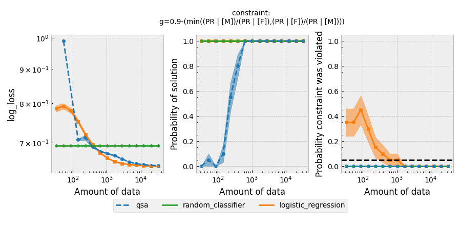
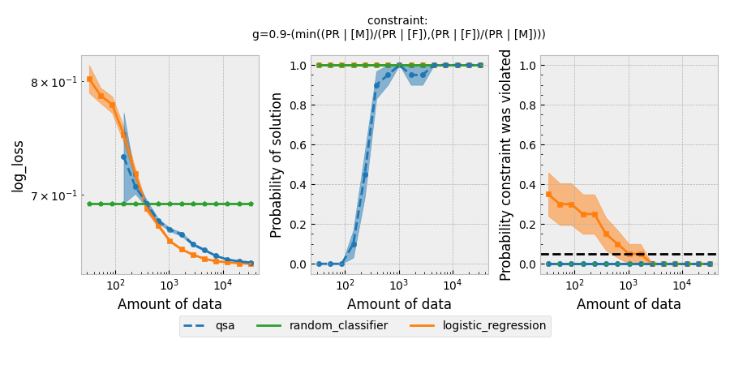
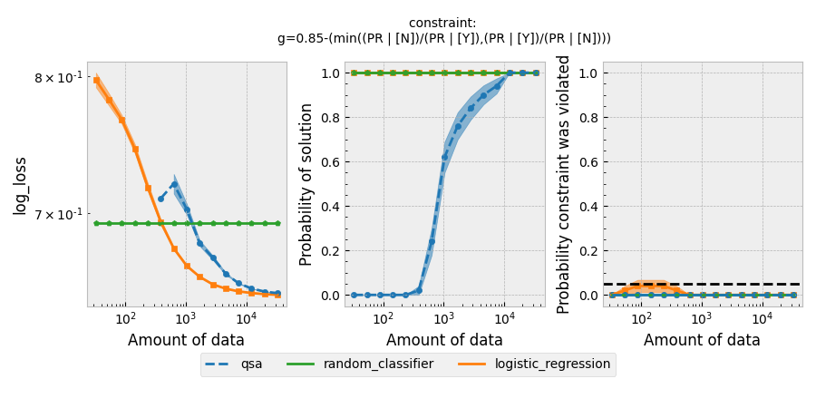
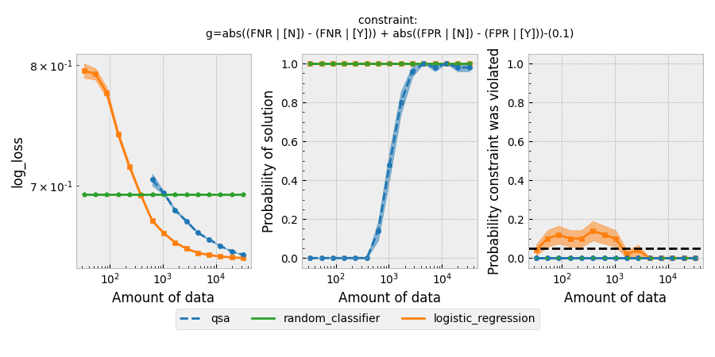
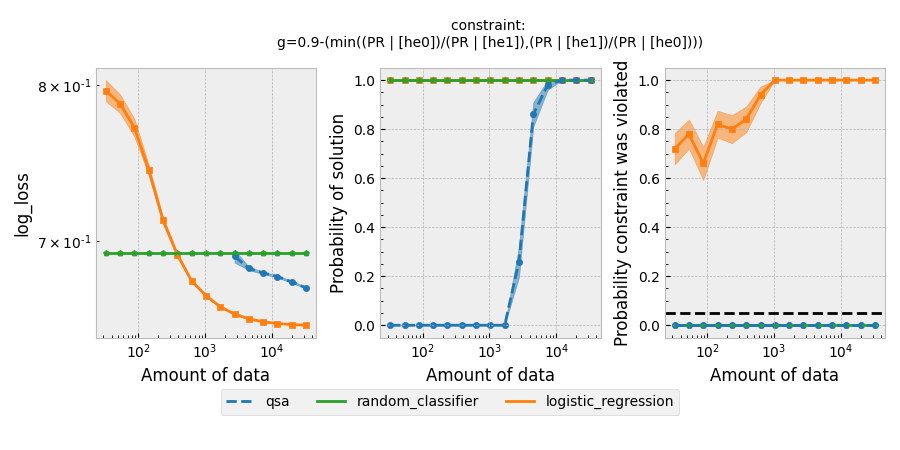
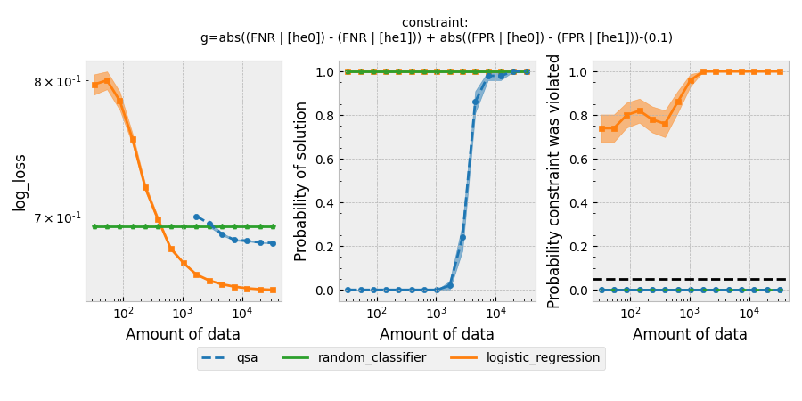

# Fairness in student course completion based on student data

## Introduction

With the increasing adoption of Massive Online Open Courses (MOOC), newer educational systems are being built, which can gauge the needs of students to suggest them courses appropriate for them. One of the key factors these systems could consider is the prediction whether if the student given the course would pass or fail the course. Apart from considering the academic factors, these systems could also take into account the personal factors like age, gender, region and disability in their prediction decision, which poses a risk of being unfair while using these attributes. There is a great scope in building fair educational systems, which can be used to provide courses to all in a fair manner.

In this tutorial, we show how Seldonian algorithm can be used in this context to build a fair online education system which is fair across various student demographics. We use the [OULAD dataset](https://analyse.kmi.open.ac.uk/open_dataset) here, which contains information about 32593 students and their demographic data, used in predicting whether a student is likely to pass the courses offered by Open University. Open University is a public British University that also has the highest number of undergraduate students in the UK. The data presented here is sourced from the Open University's Online Learning platform.

## Dataset Preparation

The dataset for this tutorial can be found at this [link](https://www.kaggle.com/datasets/anlgrbz/student-demographics-online-education-dataoulad) and the file `preprocess.py` converts the dataset, into a format suitable for our task. The following outline the dataset preparation process of our pipeline. 

- Firstly, we dropped the columns like student ID which have no importance in the predicition pipeline. 
- Secondly, we manipulated the columns like highest education where we grouped divisions like A level or equivalent, post grads, and HE qualification to be a boolean 1 whereas lower than A level and no formal quals to be 0. This is done in order to make `higher_ed` attribute to be binary valued, which is used for further analysis.
- We also converted columns like distinction to binaries. 
- The next step is to convert the categorical variables into numerical values. This is done using the LabelEncoder function of the scikit-learn library. The LabelEncoder function assigns a numerical value to each unique categorical value in the column.

- After converting the categorical variables, the next step is to standardize the numerical variables. This is done using the StandardScaler function of the scikit-learn library. The StandardScaler function standardizes the numerical variables by subtracting the mean and dividing by the standard deviation.

Once the preprocessing steps are complete, we save the dataframe and the meta data which is later used in training and experimentation. The preprocessing step is necessary because we want to work upon the attributes of `gender`, `disability` and `higher_education` to assess whether the predictions are unfair on these attributes.

## Seldonian Experiments

`exp.py` takes care of running the seldonian experiments across various spec objects. The file takes two command line inputs: `<attribute>` which is the name of the attribute to be considered for analysis (`[gender,higher_ed,disability]`) and `<constraint_type>` which is the nature of the constraint string used to create the spec object (`[disp,eq]`).

Running this script for all the spec objects creates the following experiment plots

<!--  -->
**Figure 1**: Seldonian Experiments using disparate impact and equalized odds as the definition of fairness on the _gender_ attribute.

<!--  -->
**Figure 2**: Seldonian Experiments using disparate impact and equalized odds as the definition of fairness on the _disability_ attribute.

<!--  -->
**Figure 3**: Seldonian Experiments using disparate impact and equalized odds as the definition of fairness on the _higher education_ attribute.

We compare the performance of our quasi-Seldonian algorithm (QSA)(blue) with the random classifier (green) and logistic_regression (orange) models. The points and bands in each sub-graph denotes the mean value computed across 50 trials.

## Summary

In this tutorial, we implemented the Seldonian Toolkit on the OULAD dataset, building a classifier which predicts the success of a student in a given course. We played around with a variety of constraints, both differing in constraint format and the attribute considered for fairness. We compared the performance of the Seldonian Algorithm with respect to that of a Random Classifier and a Logistic Regression model with the help of `experiments` library. For the case of `higher_ed`, as the performance of the Seldonian Algorithm approaches that of a logistic regression model without constraints, the logistic regression model violates the fairness constraints very often, while the QSA algorithm always respects the fairness bounds and delivering similar performance.